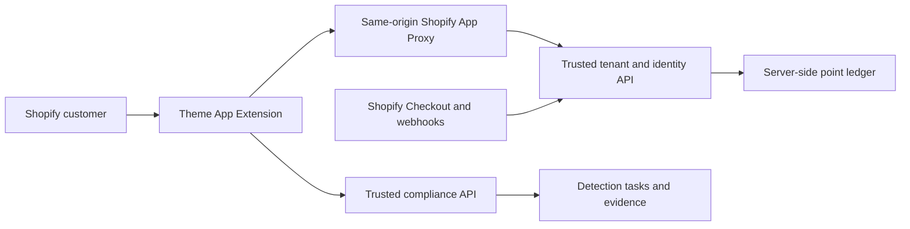

# ERiC Compliance Tools

[](https://github.com/SuntekCorps-xLab/eric-compliance-tools/actions/workflows/ci.yml)
[](https://github.com/SuntekCorps-xLab/eric-compliance-tools/actions/workflows/codeql.yml)
[](LICENSE)

ERiC Compliance Tools is the open-source Shopify storefront frontend for ERiC product-compliance screening. It packages an English React interface as a Shopify Theme App Extension, with a branded homepage and a dedicated compliance workspace.

> This repository contains frontend code only. Authentication, authorization, tenant isolation, point accounting, payment settlement, webhooks, and compliance detection must be enforced by trusted backend services.

## What it includes

- A Shopify homepage App Embed and a dedicated workspace App Block.
- Shopify Customer Account sign-in through a signed App Proxy session.
- An isolated, resumable guest-demo entry when the backend enables it.
- Product-compliance workflows for design patents, utility patents, graphic trademarks, text trademarks, safer wording, copyright, restricted products, and marketplace policy checks.
- Server-backed point balances, checkout handoff, detection history, evidence review, and private policy terms.
- Responsive desktop and mobile layouts with self-hosted, reproducible font assets.
- Unit tests, browser tests, GitHub Actions, CodeQL, and Dependabot configuration.

The frontend never performs compliance decisions, grants permissions, settles payments, or trusts a browser-provided balance.

## Architecture



Shopify owns storefront rendering, customer sessions, App Proxy signing, Checkout, and theme lifecycle. The ERiC backend owns identity mapping, authorization, point accounting, task state, and evidence. See [Architecture](docs/ARCHITECTURE.md) for trust boundaries and integration details.

## Requirements

- Node.js 22, 23, or 24
- npm 11
- Shopify CLI 3.85 or newer
- A Shopify Partner app and development store
- Public HTTPS tenant, account, logout, and compliance API endpoints compatible with the contracts used by this frontend

## Local development

```bash
git clone https://github.com/SuntekCorps-xLab/eric-compliance-tools.git
cd eric-compliance-tools
npm ci
cp .env.example .env.local
npm run dev
```

The default `VITE_API_MODE=mock` runs a local UI preview. It does not authenticate a Shopify customer, charge points, create a checkout, or call a production service.

Run the complete local quality gate:

```bash
npm run check
npx playwright install chromium
npm run test:e2e
```

## Shopify app setup

1. Copy the safe template and replace every placeholder:

   ```bash
   cp shopify.app.example.toml shopify.app.toml
   ```

2. Keep `shopify.app.toml` local. It is ignored by Git because app IDs, store domains, and environment routes belong to each deployment.
3. Build the Theme App Extension:

   ```bash
   npm run build:storefront
   shopify app build --no-color
   ```

4. Start a Shopify development session:

   ```bash
   shopify app dev
   ```

5. In the Shopify Theme Editor, configure both ERiC blocks with:
   - the same-origin App Proxy path;
   - the public tenant API base URL;
   - the public account endpoint URL;
   - the public compliance API base URL;
   - the public session logout endpoint URL.

All endpoint settings must use HTTPS and must not contain credentials. The frontend fails closed when an endpoint is missing, non-HTTPS, or contains URL credentials.

## Theme extension surfaces

| Surface              | Extension block  | Intended location                                      |
| -------------------- | ---------------- | ------------------------------------------------------ |
| Store homepage       | `ERiC homepage`  | App Embed on the home page                             |
| Compliance workspace | `ERiC workspace` | App Block on a Shopify page such as `/pages/workspace` |

Both blocks use the same generated JavaScript and CSS assets. `npm run build:storefront` rebuilds those assets from `src/`; do not edit generated files directly.

## Configuration and secrets

Browser-visible values are public by definition. Safe frontend configuration includes public API origins, an App Proxy path, and public Shopify navigation URLs.

Never commit or expose:

- Shopify app client secrets or Admin API access tokens;
- webhook signing secrets;
- private keys, passwords, fixed session tokens, or customer data;
- database credentials or internal-only service addresses.

The backend must verify Shopify App Proxy signatures, timestamps, shop allowlists, customer identity, permissions, tenant ownership, point balances, and payment webhooks. See [Security Policy](SECURITY.md).

## Available commands

| Command                    | Purpose                               |
| -------------------------- | ------------------------------------- |
| `npm run dev`              | Start the local mock preview          |
| `npm run typecheck`        | Run TypeScript checks                 |
| `npm run lint`             | Run ESLint with zero warnings allowed |
| `npm run format:check`     | Verify formatting                     |
| `npm test`                 | Run Vitest unit and integration tests |
| `npm run test:coverage`    | Run tests with coverage output        |
| `npm run test:e2e`         | Run Playwright browser flows          |
| `npm run build`            | Build the standalone local preview    |
| `npm run build:storefront` | Generate Shopify extension assets     |
| `npm run check`            | Run the full local quality gate       |

## Repository layout

```text
extensions/eric-storefront/  Shopify Liquid blocks and generated extension assets
scripts/                     Reproducible storefront asset builder
src/                         React application, services, state, and styles
tests/e2e/                   Playwright storefront and interaction tests
tests/fixtures/              Local Shopify theme harness
docs/                        Architecture, deployment, and review evidence
.github/                     CI, security scanning, templates, and dependency updates
```

## Deployment

Shopify App versions are the release unit for the Theme App Extension. A release does not deploy the proprietary backend. Follow [Deployment and rollback](docs/DEPLOYMENT.md) before publishing a version.

## Limitations

- This project is not a standalone compliance engine and is not legal advice.
- The local mock mode demonstrates interactions only; connected functionality requires compatible backend services.
- Real checkout, webhook settlement, point deduction, customer identity, and guest-session limits are server responsibilities.
- Repository CI can validate source and generated assets, but it cannot prove that a merchant's Shopify app, theme settings, backend configuration, or production monitoring is correct.

## Contributing

Read [CONTRIBUTING.md](CONTRIBUTING.md) and the [Code of Conduct](CODE_OF_CONDUCT.md) before opening a pull request. Security issues must follow [SECURITY.md](SECURITY.md), not a public issue.

## License

Licensed under the [Apache License 2.0](LICENSE). Trademark rights are not granted by the license; ERiC names and marks remain the property of their respective owners.
