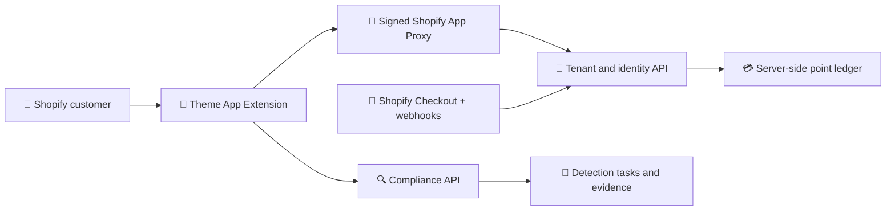
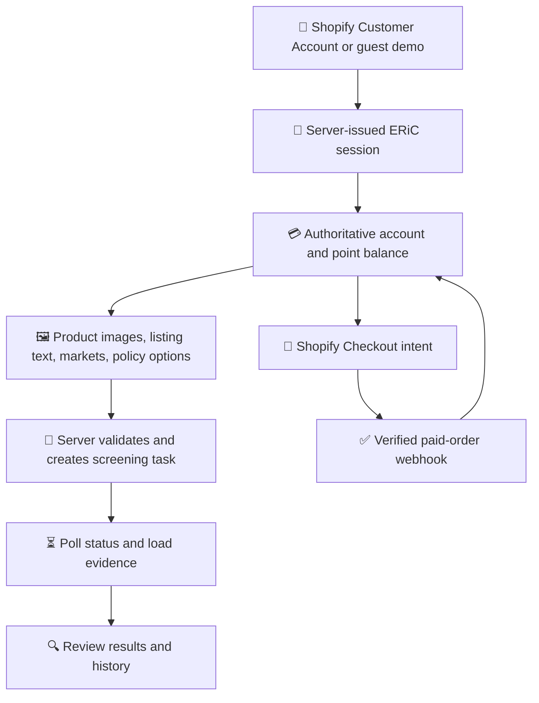

<div align="center">

# ERiC Compliance Tools

### Shopify storefront components for product-compliance screening

Inspect product claims, organize evidence, review policy outcomes, and manage a server-backed screening workflow from a Shopify Online Store 2.0 experience.

[](https://github.com/SuntekCorps-xLab/eric-compliance-tools/actions/workflows/ci.yml)
[](https://nodejs.org/)
[](https://react.dev/)
[](https://www.typescriptlang.org/)
[](https://www.shopify.com/)
[](https://vitest.dev/)
[](https://playwright.dev/)
[](LICENSE)

</div>

> **Frontend delivery package for ERiC.** This repository contains the Shopify storefront client and Theme App Extension. It does **not** contain ERiC production credentials, tenant administration, point-ledger mutation logic, payment settlement, compliance engines, private policies, or hosted backend services.

<table>
<tr>
<td width="50%" valign="top">

### 🔍 Screen

Run product-compliance workflows for patents, trademarks, copyright, safer wording, restricted products, and marketplace policies.

</td>
<td width="50%" valign="top">

### 🧾 Evidence

Upload inputs, poll server tasks, review returned evidence, and reload completed screenings from history.

</td>
</tr>
<tr>
<td width="50%" valign="top">

### 💳 Credits

Present authoritative balances, credit packs, checkout handoff, refill flows, and expiry states without moving accounting authority into the browser.

</td>
<td width="50%" valign="top">

### 🛡️ Boundaries

Keep Shopify identity, tenant ownership, guest isolation, prices, balances, policies, and payment settlement server-enforced.

</td>
</tr>
</table>

## 🧭 Contents

- [🖼️ Product surfaces](#️-product-surfaces)
- [🧩 Storefront modules](#-storefront-modules)
- [✨ Capabilities](#-capabilities)
- [🏗️ Architecture](#️-architecture)
- [🔄 Screening workflow](#-screening-workflow)
- [📦 Repository layout](#-repository-layout)
- [🚀 Quick start](#-quick-start)
- [⚙️ Configuration](#️-configuration)
- [🛍️ Storefront installation](#️-storefront-installation)
- [🔌 Integration surface](#-integration-surface)
- [🧪 Verification](#-verification)
- [🔐 Security boundary](#-security-boundary)
- [🌐 Open-source scope](#-open-source-scope)
- [🤝 Contributing](#-contributing)

## 🖼️ Product surfaces

The README focuses on the interactive storefront modules below. The extension also ships category icons for design patents, utility patents, graphic trademarks, text trademarks, copyright, policy, points, history, and reports.
### 🧩 Storefront overview

These animated previews show the ERiC compliance workspace, screening entry point, evidence-oriented workflow, and credit context in one customer-facing surface.

<p align="center">
  
</p>

> This animated product reference shows the intended storefront experience. Live screening results, evidence, balances, and policy decisions still require compatible server-side services.
## ✨ Capabilities

| Icon | Surface | What it covers | Authority |
|:---:|---|---|---|
| 🏠 | **Homepage App Embed** | ERiC landing surface, product explanation, entry points, and approved media | Theme presentation |
| 🧰 | **Workspace App Block** | Dedicated compliance workspace on a Shopify page such as `/pages/workspace` | Theme presentation + backend contract |
| 👤 | **Shopify customer entry** | Customer Account sign-in through a signed App Proxy session | Server-issued identity |
| 🧪 | **Guest demo** | Isolated, resumable demo sessions when enabled by the backend | Server-enforced guest policy |
| 🧾 | **Screening inputs** | Product images, listing text, markets, and policy options | Server validates task creation |
| 🔍 | **Evidence review** | Task polling, evidence rendering, screening history, and safe error states | Compliance API |
| 💳 | **Credits and checkout** | Balance display, credit packs, checkout handoff, refill, expiry, and settlement boundaries | Server-owned ledger |
| 🛡️ | **Policy workflows** | Patent, trademark, copyright, safer wording, restricted-product, and marketplace-policy flows | Private policy service |

## 🏗️ Architecture



The browser is an untrusted client. The storefront renders state and collects input; it does not authorize users, mutate balances, settle payments, or decide compliance outcomes.

## 🔄 Screening workflow



Guest sessions must remain isolated, expire server-side, and be denied real checkout. Customer sessions and guest sessions must never share tenant data or point ledgers.

## 📦 Repository layout

```text
extensions/eric-storefront/
  blocks/                         Shopify Liquid App Embed and App Block
  locales/                        English extension strings
  assets/                         Generated storefront JS, CSS, fonts, icons, and media
src/
  components/                     Shared UI primitives
  features/                       Auth, credits, checks, evidence, and policy UI
  pages/                          Landing, workspace, auth, and fallback pages
  services/                       API clients, normalization, policy, history, and credits
  store/                          Client state and session coordination
  assets/                         ERiC mark, icons, source media, and approved visuals
scripts/build-storefront.mjs      Reproducible Shopify extension asset builder
tests/                            Unit, contract, and browser-flow tests
docs/                             Public architecture, API, and deployment guidance
.github/                          CI, security scanning, and contribution templates
shopify.app.example.toml          Safe Shopify app configuration template
```

## 🚀 Quick start

### Prerequisites

- Node.js `22`, `23`, or `24`
- npm `11`
- Shopify CLI `3.85` or newer
- Shopify Partner or Dev Dashboard app
- Shopify development store
- Public HTTPS backend services implementing the documented contract

### Install and verify

```bash
git clone https://github.com/SuntekCorps-xLab/eric-compliance-tools.git
cd eric-compliance-tools
npm ci
cp .env.example .env.local
npm run check
```

Install Chromium once for browser tests:

```bash
npx playwright install chromium
npm run test:e2e
```

The default `VITE_API_MODE=mock` provides a local interactive preview. It does not authenticate a Shopify customer, deduct points, create checkout, or call a production service.

## ⚙️ Configuration

Tracked configuration contains placeholders only:

```bash
cp shopify.app.example.toml shopify.app.toml
```

PowerShell:

```powershell
Copy-Item shopify.app.example.toml shopify.app.toml
```

The local file is intentionally ignored by Git. Add only the Shopify scopes that your separately deployed backend demonstrably needs.

> [!CAUTION]
> Never place a Shopify client secret, Admin API token, webhook secret, private key, password, fixed session token, customer record, or private-network address in Liquid settings, environment examples, tests, or browser JavaScript.

## 🛍️ Storefront installation

1. Configure a Shopify App Proxy path, normally `/apps/eric`, backed by a service you control.
2. Build and validate the extension:

   ```bash
   npm run build:storefront
   shopify app build --no-color
   ```

3. Start a Shopify development session with `shopify app dev` and select a development store you control.
4. In the theme editor, enable **ERiC homepage** on the home page when ERiC should own the complete landing surface.
5. Add **ERiC workspace** to a Shopify page such as `/pages/workspace`.
6. Configure both blocks with the same App Proxy path and public HTTPS tenant, account, compliance, and logout endpoints.
7. Test with a development customer and non-production backend before enabling the blocks in a live theme.

Theme settings are public presentation configuration. They must never contain credentials. The client rejects missing, non-HTTPS, or credential-bearing API URLs.

## 🔌 Integration surface

The storefront uses three public integration surfaces:

| Surface | Responsibility | Reference |
|---|---|---|
| 🔐 Same-origin Shopify App Proxy | Customer and guest session exchange | Signed request and identity rules in [API contract](docs/API_CONTRACT.md) |
| 🧠 Tenant API | Account, credit-pack, checkout, purchase, refill, and logout operations | Backend-owned tenant and ledger authority |
| 🔍 Compliance API | Uploads, screening tasks, status, evidence, history, safer wording, and policy terms | Backend-owned detection and policy authority |

Methods, routes, headers, response envelopes, identity rules, and fail-closed requirements are documented in [docs/API_CONTRACT.md](docs/API_CONTRACT.md).

## 🧪 Verification

| Check | Command | Coverage |
|---|---|---|
| 🧹 Formatting | `npm run format:check` | Repository formatting consistency |
| 🧬 Type safety | `npm run typecheck` | TypeScript project references |
| 🔎 Lint | `npm run lint` | ESLint with zero warnings allowed |
| 🧪 Unit and integration | `npm test` | Domain, service, store, auth, policy, and contract behavior |
| 📊 Coverage | `npm run test:coverage` | Coverage thresholds and quality evidence |
| 🏗️ App build | `npm run build` | Standalone local preview |
| 🧰 Storefront bundle | `npm run build:storefront` | Generated Shopify extension assets |
| 🌐 Browser flows | `npm run test:e2e` | Desktop, mobile, prototype, and guest flows |
| ✅ Release gate | `npm run check` | Formatting, types, lint, tests, and builds |

Generated files under `extensions/eric-storefront/assets/` must be rebuilt and committed whenever storefront source, styles, fonts, or media change. Do not edit generated assets directly.

## 🔐 Security boundary

The backend must, for every protected operation:

1. Verify the Shopify App Proxy signature, timestamp, store, and customer identity.
2. Resolve user and tenant ownership from the authenticated session; never trust browser IDs as authority.
3. Enforce permissions, guest limits, rate limits, and screening access on the server.
4. Treat prices, point balances, deductions, refunds, and expiry as server-owned state.
5. Grant purchased points only after an authenticated, idempotent paid-order webhook.
6. Keep Shopify secrets, Admin API tokens, signing keys, private rules, and customer data outside browser code and theme settings.
7. Return customer-safe errors and redact tokens, signatures, personal data, and internal details from logs.

See [docs/API_CONTRACT.md](docs/API_CONTRACT.md), [docs/ARCHITECTURE.md](docs/ARCHITECTURE.md), [SECURITY.md](SECURITY.md), and [.github/REPOSITORY_SETTINGS.md](.github/REPOSITORY_SETTINGS.md).

## 🌐 Open-source scope

### ✅ Safe to publish

- Theme App Extension UI, Liquid blocks, styling, icons, and approved media
- Browser API clients without credentials
- Validation and response-normalization helpers
- Unit, integration, and browser tests with synthetic fixtures
- Example configuration containing placeholders
- Public API contracts, architecture, security, and deployment guidance

### 🔒 Keep private

- Shopify secrets, Admin API tokens, webhook signing keys, and session signing material
- Production store identifiers, private-network addresses, and infrastructure configuration
- Customer identities, uploads, screening inputs, evidence, purchase records, and logs
- Detection models, proprietary datasets, private risk terms, scoring rules, and legal-review tooling
- Point-ledger mutation logic, payment settlement, fraud controls, and operational runbooks

## 🤝 Contributing

Read [CONTRIBUTING.md](CONTRIBUTING.md) and the [Code of Conduct](CODE_OF_CONDUCT.md) before opening a pull request. Changes must pass `npm run check` and must not weaken identity, tenant, guest-session, checkout, or point-accounting boundaries.

## 🚨 Responsible disclosure

Do not open public issues for vulnerabilities or exposed credentials. Follow [SECURITY.md](SECURITY.md).

## 📄 License and trademarks

Code is licensed under the [Apache License 2.0](LICENSE). The license does not grant rights to ERiC names, logos, service marks, hosted APIs, proprietary data, or other brand assets. See [TRADEMARKS.md](TRADEMARKS.md) and [NOTICE](NOTICE).

<div align="center">

**Screen clearly. Keep evidence accountable.**

</div>
