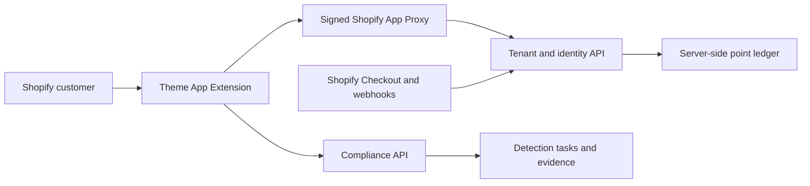
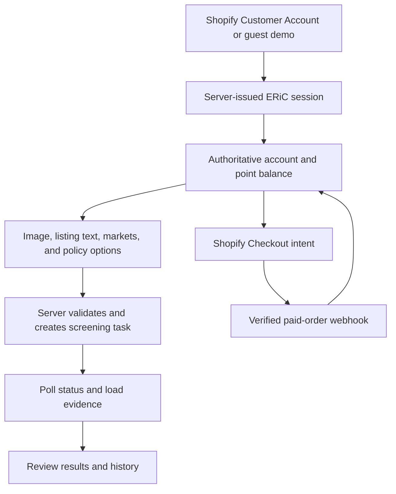

# ERiC Compliance Tools for Shopify

Open-source storefront components for running ERiC product-compliance checks from a Shopify Online Store 2.0 theme. The project provides an English homepage, a dedicated compliance workspace, customer-account and guest-demo entry, prepaid-credit presentation, screening history, and evidence review.

> This repository contains the Shopify storefront client only. It does **not** contain ERiC production credentials, Shopify secrets, tenant administration, point-ledger logic, payment settlement, compliance engines, private policies, or hosted backend services.

## Capabilities

- Shopify homepage App Embed and dedicated workspace App Block
- Shopify Customer Account sign-in through a signed App Proxy session
- Isolated, resumable guest-demo entry when enabled by the backend
- Design patent, utility patent, graphic trademark, text trademark, safer-wording, copyright, restricted-product, and marketplace-policy workflows
- Server-backed point balances, checkout handoff, screening history, evidence review, and private policy terms
- Responsive desktop and mobile layouts with self-hosted font assets
- Local mock preview, contract and browser tests, CI, CodeQL, Dependency Review, OpenSSF Scorecard, release SBOMs, and Dependabot

## Security boundary

The browser is untrusted. Storefront validation improves usability, but it is never an authorization, accounting, or compliance control.



The backend must, for every protected operation:

1. Verify the Shopify App Proxy signature, timestamp, store, and customer identity.
2. Resolve user and tenant ownership from the authenticated session; never trust browser IDs as authority.
3. Enforce permissions, guest limits, rate limits, and screening access on the server.
4. Treat prices, point balances, deductions, refunds, and expiry as server-owned state.
5. Grant purchased points only after an authenticated, idempotent paid-order webhook.
6. Keep Shopify secrets, Admin API tokens, signing keys, private rules, and customer data outside browser code and theme settings.
7. Return customer-safe errors and redact tokens, signatures, personal data, and internal details from logs.

See the [storefront API contract](docs/API_CONTRACT.md), [architecture](docs/ARCHITECTURE.md), and [security policy](SECURITY.md). Repository administrators should also apply the [recommended GitHub settings](.github/REPOSITORY_SETTINGS.md).

## Repository layout

```text
extensions/eric-storefront/
  blocks/                         Shopify Liquid App Embed and App Block
  locales/                        English extension strings
  assets/                         generated storefront assets
scripts/build-storefront.mjs      reproducible extension asset builder
src/                              React UI, services, state, and styles
tests/e2e/                        Playwright browser-flow tests
tests/fixtures/                   local Shopify theme harness
docs/                             public integration and release guidance
.github/                          CI, security scanning, and contribution templates
shopify.app.example.toml          safe Shopify app configuration template
```

## Requirements

- Node.js 22, 23, or 24
- npm 11
- Shopify CLI 3.85 or newer
- A Shopify Partner or Dev Dashboard app and a development store
- Public HTTPS backend services that implement the documented contract

## Local verification

```bash
git clone https://github.com/SuntekCorps-xLab/eric-compliance-tools.git
cd eric-compliance-tools
npm ci
cp .env.example .env.local
npm run check
```

Install Chromium once, then run the browser suite:

```bash
npx playwright install chromium
npm run test:e2e
```

The default `VITE_API_MODE=mock` provides a local interactive preview. It does not authenticate a Shopify customer, deduct points, create a checkout, or call a production service.

## Configuration

Tracked configuration contains placeholders only. Copy the examples locally:

```bash
cp shopify.app.example.toml shopify.app.toml
```

On PowerShell:

```powershell
Copy-Item shopify.app.example.toml shopify.app.toml
```

The local files are intentionally ignored by Git. Add only the Shopify scopes that your separately deployed backend demonstrably needs.

Never place a Shopify client secret, Admin API token, webhook secret, private key, password, fixed session token, customer record, or private-network address in Liquid settings, environment examples, tests, or browser JavaScript.

## Storefront installation

1. Configure a Shopify App Proxy path, normally `/apps/eric`, backed by a service you control.
2. Build and validate the extension:

   ```bash
   npm run build:storefront
   shopify app build --no-color
   ```

3. Start a Shopify development session with `shopify app dev` and select a development store you control.
4. In the theme editor, enable **ERiC homepage** on the home page when ERiC should provide the complete landing surface.
5. Add **ERiC workspace** to a Shopify page such as `/pages/workspace`.
6. Configure both blocks with the same App Proxy path and the public HTTPS tenant, account, compliance, and logout endpoints.
7. Test with a development customer and non-production backend before enabling the blocks in a live theme.

Theme settings are public presentation configuration. They must never contain credentials. The client rejects missing, non-HTTPS, or credential-bearing API URLs.

## Account and screening workflow



Guest sessions must remain isolated, expire server-side, and be denied real checkout. Shopify customer sessions and guest sessions must never share tenant data or point ledgers.

## API compatibility

The storefront uses three public integration surfaces:

- the same-origin Shopify App Proxy for customer and guest session exchange;
- the tenant API for account, credit-pack, checkout, purchase, refill, and logout operations;
- the compliance API for uploads, screening tasks, status, evidence, history, safer wording, and policy-term management.

Methods, routes, headers, response envelopes, identity rules, and fail-closed requirements are documented in [docs/API_CONTRACT.md](docs/API_CONTRACT.md).

## Open-source scope

Safe to publish:

- Theme App Extension UI, Liquid blocks, styling, icons, and approved media
- Browser API clients without credentials
- Validation and response-normalization helpers
- Unit, integration, and browser tests with synthetic fixtures
- Example configuration containing placeholders
- Public API contracts, architecture, security, and deployment guidance

Keep private:

- Shopify secrets, Admin API tokens, webhook signing keys, and session signing material
- Production store identifiers, private-network addresses, and infrastructure configuration
- Customer identities, uploads, screening inputs, evidence, purchase records, and logs
- Detection models, proprietary datasets, private risk terms, scoring rules, and legal-review tooling
- Point-ledger mutation logic, payment settlement, fraud controls, and operational runbooks

## Commands

| Command                    | Purpose                                   |
| -------------------------- | ----------------------------------------- |
| `npm run dev`              | Start the local mock preview              |
| `npm run typecheck`        | Run TypeScript checks                     |
| `npm run lint`             | Run ESLint with zero warnings allowed     |
| `npm run format:check`     | Verify formatting                         |
| `npm test`                 | Run Vitest unit and integration tests     |
| `npm run test:coverage`    | Run tests and enforce coverage thresholds |
| `npm run test:e2e`         | Run desktop and mobile Playwright flows   |
| `npm run build`            | Build the standalone local preview        |
| `npm run build:storefront` | Generate Shopify extension assets         |
| `npm run check`            | Run the complete local quality gate       |

Generated files under `extensions/eric-storefront/assets/` must be rebuilt and committed whenever storefront source, styles, fonts, or media change. Do not edit them directly.

## Deployment and limitations

Shopify App versions are the release unit for this Theme App Extension. A release does not deploy the proprietary ERiC backend. Follow [deployment and rollback](docs/DEPLOYMENT.md) before publishing a version.

- This project is not a compliance engine and does not provide legal advice.
- Connected functionality requires compatible, independently secured backend services.
- Real authentication, authorization, tenant isolation, point accounting, payment settlement, webhook processing, and monitoring cannot be proven by this frontend repository alone.

## Contributing and disclosure

Read [CONTRIBUTING.md](CONTRIBUTING.md) and the [Code of Conduct](CODE_OF_CONDUCT.md) before opening a pull request. Changes must pass `npm run check` and must not weaken identity, tenant, guest-session, checkout, or point-accounting boundaries.

Do not open public issues for vulnerabilities or exposed credentials. Follow [SECURITY.md](SECURITY.md).

## License and trademarks

Code is licensed under the [Apache License 2.0](LICENSE). The license does not grant rights to ERiC names, logos, service marks, hosted APIs, proprietary data, or other brand assets. See [TRADEMARKS.md](TRADEMARKS.md) and [NOTICE](NOTICE).
